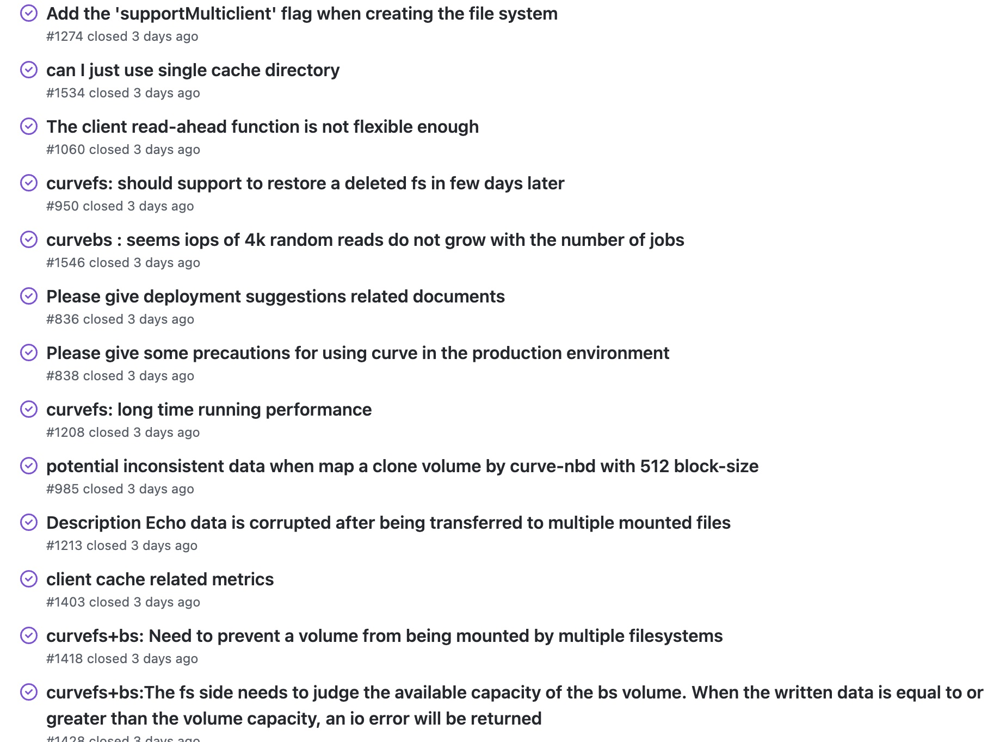

# January 1, 2023 – January 8, 2023

## Overview

| Merged pull requests | Open pull requests | Closed issues | New issues | release |
|-- | -- | -- | -- | -- |
| 7 | 2 | 46 | 5 | 0 |

## 7 Pull requests merged by 3 people

|pr|title|
|:--|:--|
|[2165](https://github.com/opencurve/curve/pull/2165)|[feat]curvefs: support memcached in container
|[2173](https://github.com/opencurve/curve/pull/2173)|curvebs/mds: add cluster io metrics
|[2176](https://github.com/opencurve/curve/pull/2176)|curvebs/mds: add curvebs logicpool io metric
|[2182](https://github.com/opencurve/curve/pull/2182)|[fix] use golang.google.cn to dowanlod go1.12.8
|[2184](https://github.com/opencurve/curve/pull/2184)|doc: add curve metric analyze
|[2186](https://github.com/opencurve/curve/pull/2186)|doc: add curve metric analyze
|[2187](https://github.com/opencurve/curve/pull/2187)|[fix] rm memcached in base image

## 2 Pull requests opened by 2 people
|pr|title|
|:--|:--|
|[2183](https://github.com/opencurve/curve/pull/2183)|avoid memcpy when using RocksDB slice
|[2191](https://github.com/opencurve/curve/pull/2191)|[fix]curvefs:make image/create fs error

## 46 Issues closed by 3 people

## 5 Issues opened by 3 people
|pr|title|
|:--|:--|
|[2190](https://github.com/opencurve/curve/pull/2190)|missing entry of the yaml
|[2189](https://github.com/opencurve/curve/pull/2189)|There is a problem with the packaging script
|[2188](https://github.com/opencurve/curve/pull/2188)|curvefs_tool need read the conf of volumeCluster
|[2185](https://github.com/opencurve/curve/pull/2188)|print error code with more meaningful name|
|[2181](https://github.com/opencurve/curve/pull/2181)|[curvebs] ut.sh curvebs run fail in build-debian9

