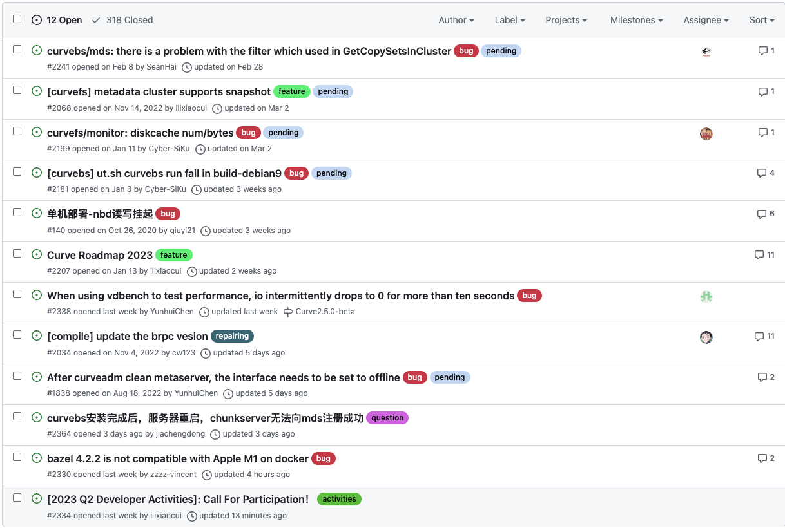
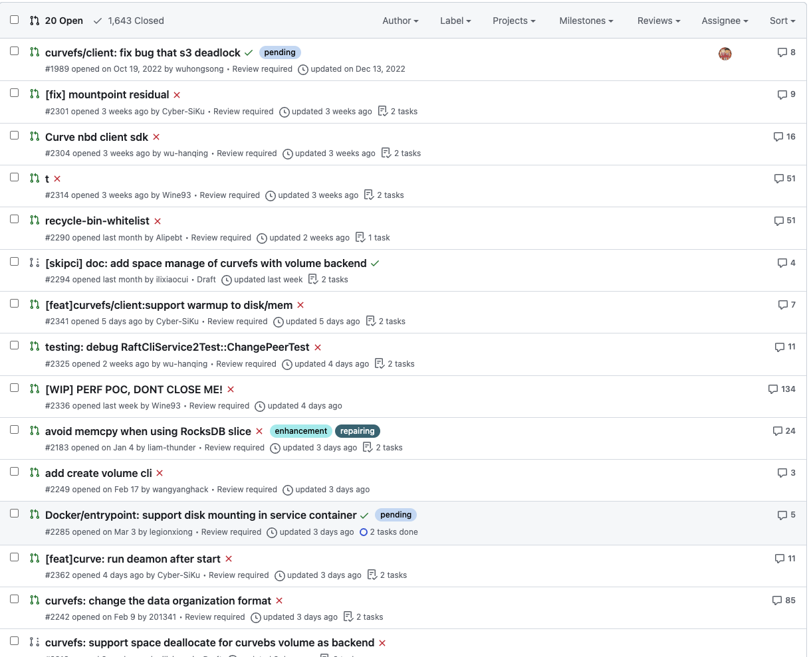

# March 27, 2023 – April 2, 2023

## Overview

| Merged pull requests | Open pull requests | Closed issues | New issues | release |
|-- | -- | -- | -- | -- |
| 4 | 7 | 3 | 21 | 0 |

## PR Overview

[issue updated sort by asc](https://github.com/opencurve/curve/issues?q=is%3Aopen+is%3Aissue+-label%3A%22good+first+issue%22+-label%3Alow+-label%3Aenhancement+sort%3Aupdated-asc+-label%3A%22need+test%22+)

## Issue Overview

[pr updated sort by asc](https://github.com/opencurve/curve/pulls?q=is%3Apr+is%3Aopen+sort%3Aupdated-asc)

