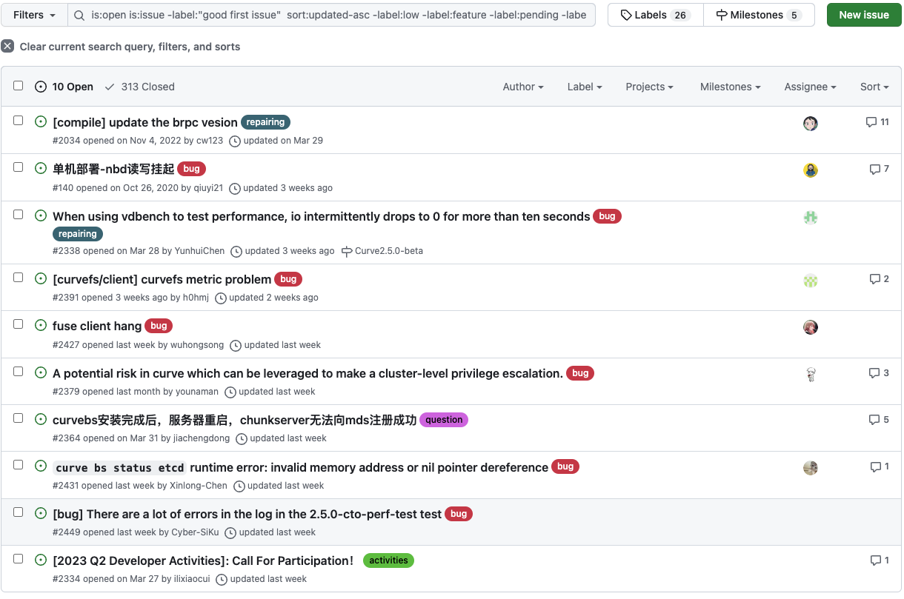

# April 24, 2023 – May 4, 2023

## Overview

| Merged pull requests | Open pull requests | Closed issues | New issues | release |
| -------------------- | ------------------ | ------------- | ---------- | ------- |
| 4                   | 5                  | 0             | 3          | 0       |

## PR Overview

[pr updated sort by asc](https://github.com/opencurve/curve/pulls?q=is%3Apr+is%3Aopen+sort%3Aupdated-asc+-label%3Apending+)

## Issue Overview

[issue updated sort by asc](https://github.com/opencurve/curve/issues?q=is%3Aopen+is%3Aissue+-label%3A%22good+first+issue%22++sort%3Aupdated-asc+-label%3Alow+-label%3Afeature+-label%3Apending+-label%3A%22need+test%22+-label%3Aenhancement)

