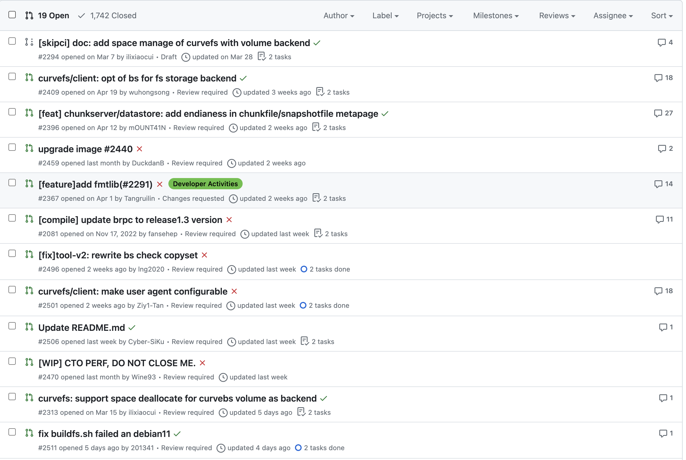
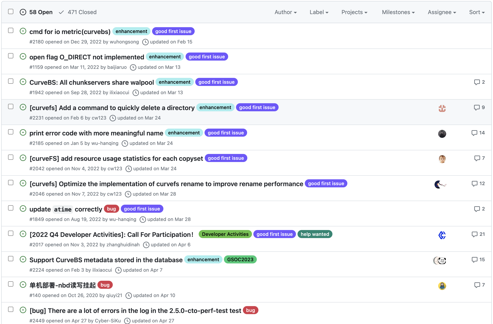

# May 29, 2023 – Jun 5, 2023

## Overview

| Merged pull requests | Open pull requests | Closed issues | New issues | release |
|-- | -- | -- | -- | -- |
| 6 | 4 | 1 | 4 | 0 |

## PR Overview

[pr updated sort by asc](https://github.com/opencurve/curve/pulls?q=is%3Apr+is%3Aopen+sort%3Aupdated-asc+-label%3Apending++-label%3Areparing)

## Issue Overview

[issue updated sort by asc](https://github.com/opencurve/curve/issues?q=is%3Aissue+is%3Aopen+sort%3Aupdated-asc+-label%3Apending+-label%3Alow+-label%3A%22need+test%22+++-label%3A%22good+first+issue%22++-label%3A%22repairing%22+)

