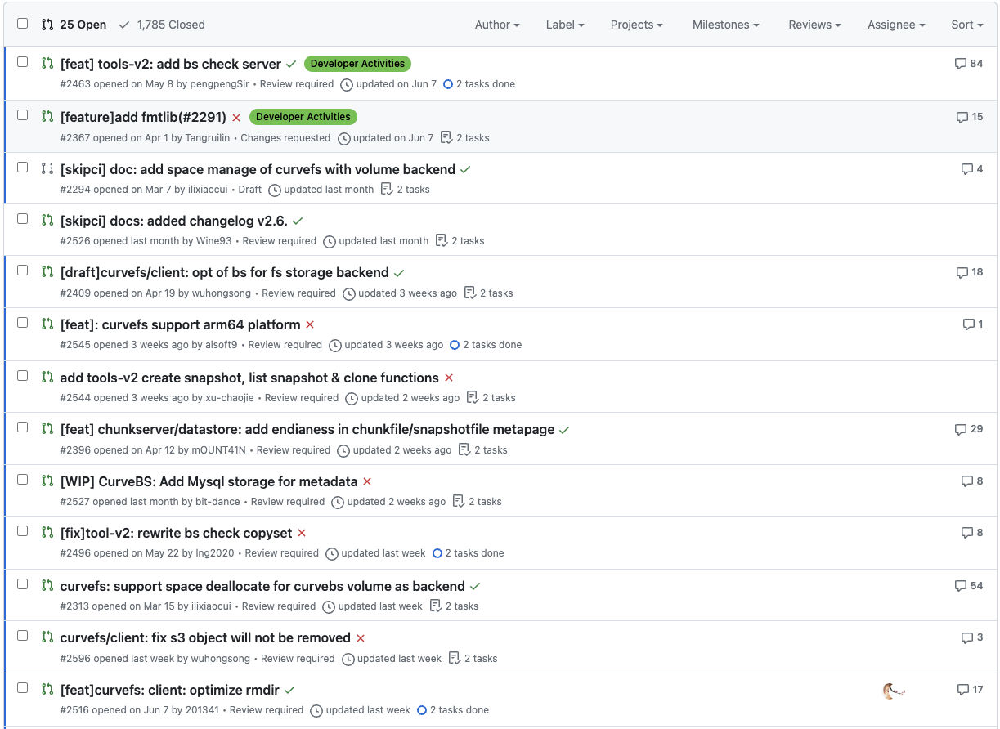
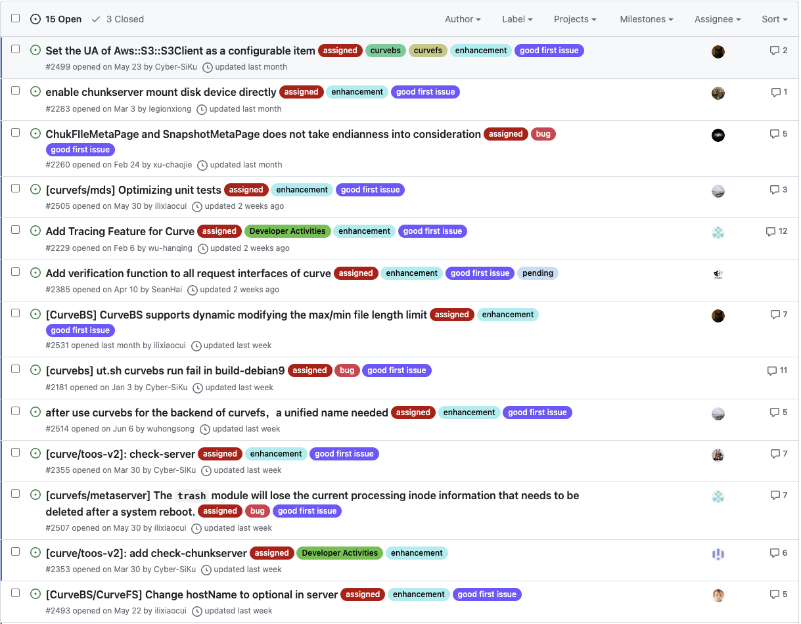

# Jul 03, 2023 – Jul 10, 2023

## Overview

| Merged pull requests | Open pull requests | Closed issues | New issues | release |
| -------------------- | ------------------ | ------------- | ---------- | ------- |
| 7                    | 2                  | 0             | 4          | 0       |

## PR Overview

[pr updated sort by asc](https://github.com/opencurve/curve/pulls?q=is%3Apr+is%3Aopen+sort%3Aupdated-asc+-label%3Apending)

### PR with no progress for a long time

1. https://github.com/opencurve/curve/pull/2367
2. https://github.com/opencurve/curve/pull/2294 (@ilixiaocui)
3. https://github.com/opencurve/curve/pull/2409 (@wuhongsong)
4. https://github.com/opencurve/curve/pull/2396 (need review again @xu-chaojie @Cyber-Siku)
5. https://github.com/opencurve/curve/pull/2496

## Issue Overview

[issue updated sort by asc](https://github.com/opencurve/curve/issues?q=is%3Aissue+is%3Aopen+label%3Aassigned+sort%3Aupdated-asc)

