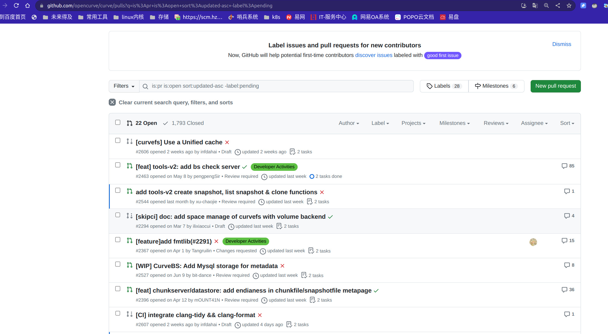
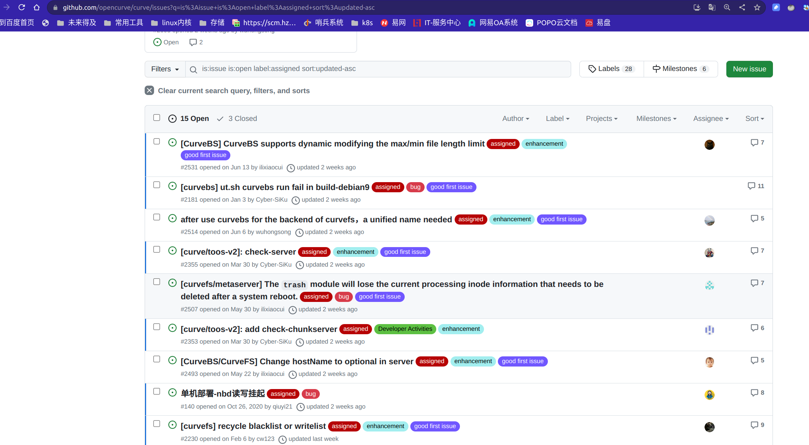

# Jul 11, 2023 – Jul 17, 2023

## Overview

| Merged pull requests | Open pull requests | Closed issues | New issues | release |
| -------------------- | ------------------ | ------------- | ---------- | ------- |
| 4                    | 4                 | 0             | 2          | 0       |

## PR Overview

[pr updated sort by asc](https://github.com/opencurve/curve/pulls?q=is%3Apr+is%3Aopen+sort%3Aupdated-asc+-label%3Apending)

### PR with no progress for a long time

1. https://github.com/opencurve/curve/pull/2367 (@chengyi)
2.
1.
1. https://github.com/opencurve/curve/pull/2396 has review last week by @xu-chaojie
2. https://github.com/opencurve/curve/pull/2496  penging  , mentor @chengyi

## Issue Overview

[issue updated sort by asc](https://github.com/opencurve/curve/issues?q=is%3Aissue+is%3Aopen+label%3Aassigned+sort%3Aupdated-asc)

