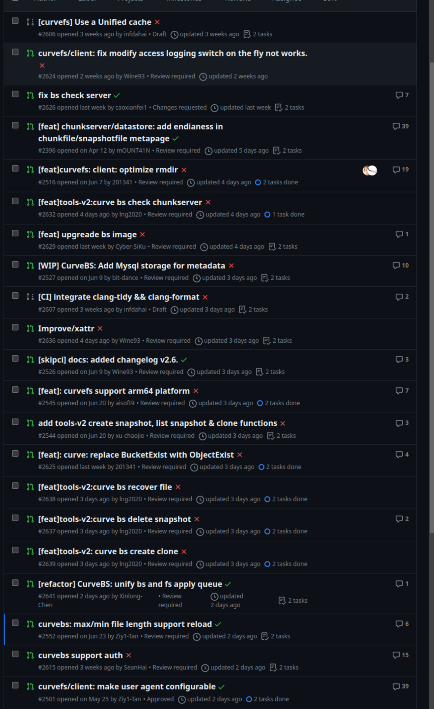
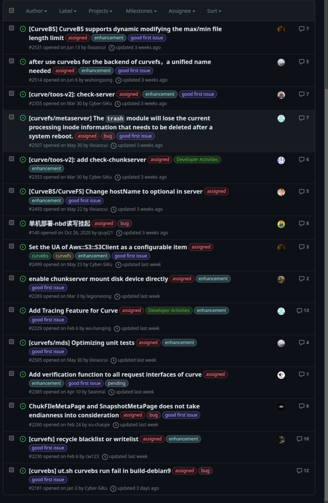

# Jul 17, 2023 – Jul 24, 2023

## Overview

| Merged pull requests | Open pull requests | Closed issues | New issues | release |
| -------------------- | ------------------ | ------------- | ---------- | ------- |
| 8                    | 11                 | 1             | 2          | 0       |

## PR Overview

[pr updated sort by asc](https://github.com/opencurve/curve/pulls?q=is%3Apr+is%3Aopen+sort%3Aupdated-asc+-label%3Apending)

### PR with no progress for a long time

1. [curvebs: max/min file length support reload](https://github.com/opencurve/curve/pull/2552) @Ziy1-Tan
2. [curvefs/client: make user agent configurable](https://github.com/opencurve/curve/pull/2501) @Ziy1-Tan

## Issue Overview

[issue updated sort by asc](https://github.com/opencurve/curve/issues?q=is%3Aissue+is%3Aopen+label%3Aassigned+sort%3Aupdated-asc)

