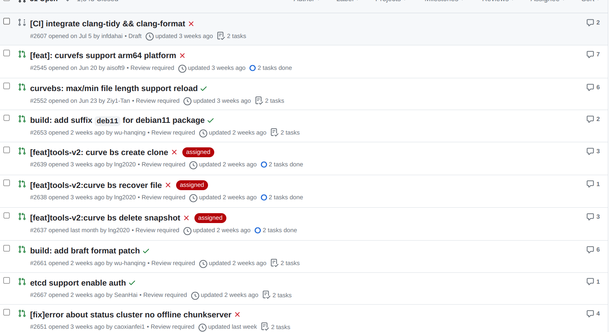

# Aug 07, 2023 – Aug 14, 2023

## Overview

| Merged pull requests | Open pull requests | Closed issues | New issues | release |
| -------------------- | ------------------ | ------------- | ---------- | ------- |
| 5                    | 6                | 0             | 2          | 0       |

## 几个较长时间没处理的issue/pr

https://github.com/opencurve/curve/issues/140 -- bs的问题，去年的，但是今年又有人问，自动stale掉
https://github.com/opencurve/curve/issues/2531  -- ziy1-Tan
https://github.com/opencurve/curve/pull/2285  --- 有两个pr，已经merge一个，艾特他了

## PR Overview

[pr updated sort by asc](https://github.com/opencurve/curve/pulls?q=is%3Apr+is%3Aopen+sort%3Aupdated-asc+-label%3Apending)

## Issue Overview

[issue updated sort by asc](https://github.com/opencurve/curve/issues?q=is%3Aissue+is%3Aopen+label%3Aassigned+sort%3Aupdated-asc)

