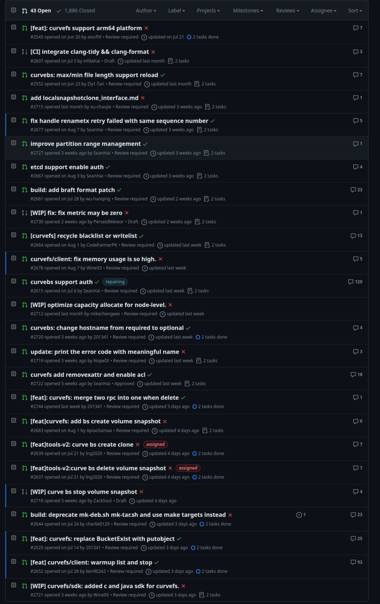
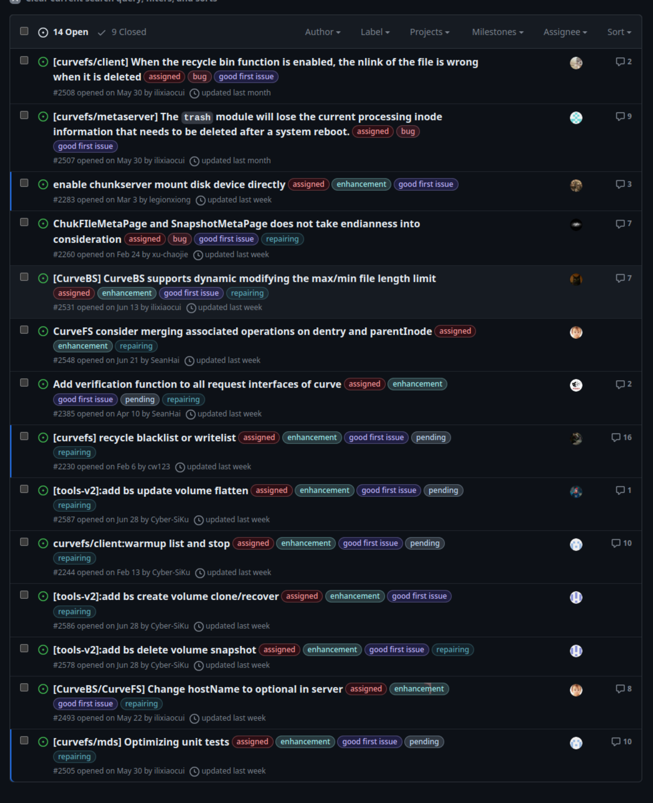

# September 10, 2023 – September 17, 2023

## Overview

| Merged pull requests | Open pull requests | Closed issues | New issues | release |
| -------------------- | ------------------ | ------------- | ---------- | ------- |
| 8                    | 9                  | 2             | 2          | 1       |

## long time no update

1. <https://github.com/opencurve/curve/pull/2545>

> arm64 分支，需要合并到 master 分支，需要我们自己后续修改，开发者放弃修改
> 其他的外部开发者（正在测试的）有意修改

2. <https://github.com/opencurve/curve/pull/2396>

> 开发者最近更新了，已请求review @xu-chaojie

## PR Overview

[pr updated sort by asc](https://github.com/opencurve/curve/pulls?q=is%3Apr+is%3Aopen+sort%3Aupdated-asc+-label%3Apending)

## Issue Overview

[issue updated sort by asc](https://github.com/opencurve/curve/issues?q=is%3Aissue+is%3Aopen+label%3Aassigned+sort%3Aupdated-asc)

